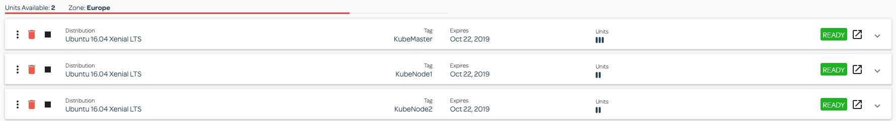

## Install Kubernetes from scratch on Ubuntu 16.04 Xenial LTS

The aim of this repository is to learn how to install Kubernetes from scratch using kubeadm.
While creating this repository I used Linux Academy Cloud Servers with the following setup



Steps involved:

1. KubeMaster, KubeNode1 and KubeNode2:  
    Install Docker (```learnyoukubernetes/docker_install.sh```)  
    Install Kubernetes (```learnyoukubernetes/kubernetes_install.sh```)
    
2. KubeMaster:  
    ```$ sudo kubeadm init --pod-network-cidr=10.244.0.0/16```       
    ```
    stdout
    ...
       You should now deploy a pod network to the cluster.
       Run "kubectl apply -f [podnetwork].yaml" with one of the options listed at:
         https://kubernetes.io/docs/concepts/cluster-administration/addons/
       
       Then you can join any number of worker nodes by running the following on each as root:
       
       kubeadm join <kubemaster_private_ip>:6443 --token <secret.token> \
           --discovery-token-ca-cert-hash sha256:<hash>
   ...
   ```  
    ```$ mkdir -p $HOME/.kube```  
    ```$ sudo cp -i /etc/kubernetes/admin.conf $HOME/.kube/config```    
    ```$ sudo chown $(id -u):$(id -g) $HOME/.kube/config```   
    ```$ kubectl version``` 
    ```
    stdout
    
    Client Version: version.Info{Major:"1", Minor:"15", GitVersion:"v1.15.3", GitCommit:"2d3c76f9091b6bec110a5e63777c332469e0cba2", GitTreeState:"clean", BuildDate:"2019-08-19T11:13:54Z", GoVersion:"go1.12.9", Compiler:"gc", Platform:"linux/amd64"}
    Server Version: version.Info{Major:"1", Minor:"15", GitVersion:"v1.15.3", GitCommit:"2d3c76f9091b6bec110a5e63777c332469e0cba2", GitTreeState:"clean", BuildDate:"2019-08-19T11:05:50Z", GoVersion:"go1.12.9", Compiler:"gc", Platform:"linux/amd64"
    ```  

3. KubeMaster, KubeNode1 and KubeNode2:  
    ```$ echo "net.bridge.bridge-nf-call-iptables=1" | sudo tee -a /etc/sysctl.conf```  
    ```$ sudo sysctl -p```  
    ```$ kubeadm join <kubemaster_private_ip>:6443 --token <secret.token> --discovery-token-ca-cert-hash sha256:<hash>```    

4. KubeMaster:  
    ```$ kubectl apply -f https://raw.githubusercontent.com/coreos/flannel/master/Documentation/kube-flannel.yml```  
    ```
    stdout
    podsecuritypolicy.policy/psp.flannel.unprivileged created
    clusterrole.rbac.authorization.k8s.io/flannel created
    clusterrolebinding.rbac.authorization.k8s.io/flannel created
    serviceaccount/flannel created
    configmap/kube-flannel-cfg created
    daemonset.apps/kube-flannel-ds-amd64 created
    daemonset.apps/kube-flannel-ds-arm64 created
    daemonset.apps/kube-flannel-ds-arm created
    daemonset.apps/kube-flannel-ds-ppc64le created
    daemonset.apps/kube-flannel-ds-s390x created
    ```  
   ```$ kubectl get nodes && kubectl get pods -n kube-system```  
   ```
   stdout
   NAME                     STATUS   ROLES    AGE   VERSION
   xxxx.mylabserver.com   Ready    master   35m   v1.15.3
   xxxx.mylabserver.com   Ready    <none>   34m   v1.15.3
   xxxx.mylabserver.com   Ready    <none>   34m   v1.15.3
   NAME                                             READY   STATUS    RESTARTS   AGE
   coredns-5c98db65d4-52r6k                         1/1     Running   0          35m
   coredns-5c98db65d4-75l7s                         1/1     Running   0          35m
   etcd-xxxxxx.mylabserver.com                      1/1     Running   0          34m
   kube-apiserver-xxxxxx.mylabserver.com            1/1     Running   0          34m
   kube-controller-manager-xxxxxx.mylabserver.com   1/1     Running   0          34m
   kube-flannel-ds-amd64-72nxc                      1/1     Running   0          19m
   kube-flannel-ds-amd64-8cmfm                      1/1     Running   0          19m
   kube-flannel-ds-amd64-8p7k9                      1/1     Running   0          19m
   kube-proxy-g4hhf                                 1/1     Running   0          34m
   kube-proxy-jsg9h                                 1/1     Running   0          35m
   kube-proxy-z6wwz                                 1/1     Running   0          34m
   kube-scheduler-xxxxxx.mylabserver.com            1/1     Running   0          34m
   ```
Note: The above scripts are written for Debian based distribution
 